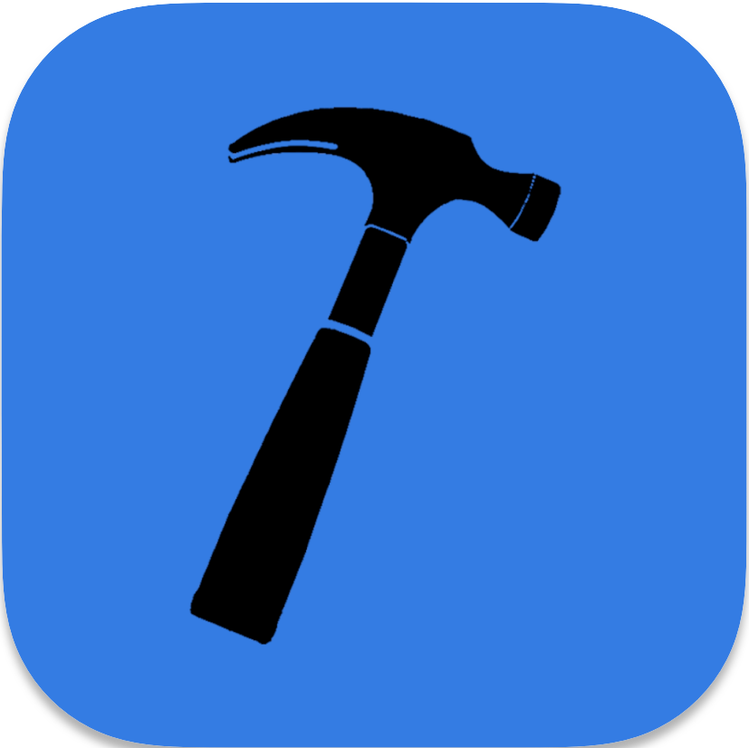
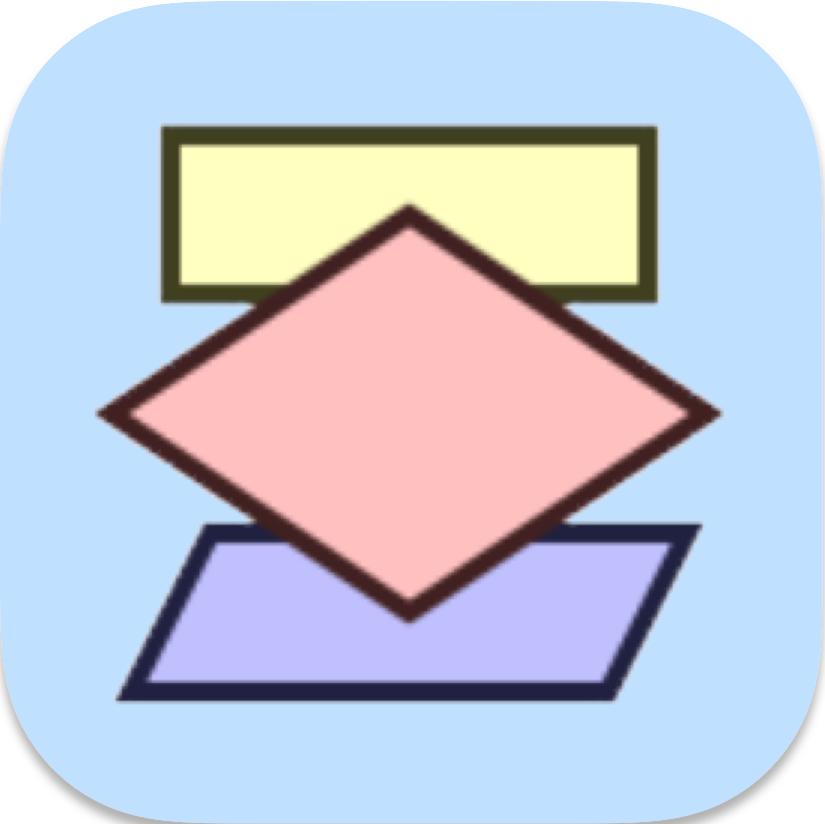

<h1 align="center">Hi, I'm Vincenzo Di Vita</h1>

👋 I am a passionate developer specializing in Services and Microservices Development. Currently, I work as a Full Stack Web Developer at Future +, where I have extensive expertise in both Front-End and Back-End development. My skills span across Vue, React, NestJS, .Net, and Laravel frameworks. I have a particular interest in Back-end projects, and I find great excitement in working on projects that involve API development.

🎓 I have successfully completed the Boolean course, where I honed my skills in Front-End and Back-End Development. This comprehensive training has provided me with a robust foundation and hands-on experience in HTML, CSS, JavaScript, PHP, and MySQL. Additionally, I undertook an academy with NS12, where I delved deeper into backend development for services and microservices. During this program, I gained proficiency in technologies such as JavaScript, TypeScript, C#, Node.js, NestJS, .NET, MSSQL, PostgreSQL, and MongoDB.

🚀 Currently, I'm dedicating my efforts to crafting my personal music practice web app. In my free time, you'll often find me exploring different Arduino projects, immersed in the joy of DIY.

💼 I invite you to explore my GitHub profile, where you'll discover a collection of my key projects, encompassing work from the Boolean Course, NS12 Academy, and personal endeavors. Each project represents a unique challenge and underscores my dedication to code quality and innovation.

🌐 To learn more about me, visit my <a href="https://divitavincenzo.com">website</a>  and follow me on <a href="https://www.linkedin.com/in/vincenzodivita/">linkedin</a>!

<h4 align="left">IDE used:</h4>

 
    
    
        
    

<h4 align="left">Languages, libraries and frameworks used for front-end development:</h4>

 
     
     
     
     
    
     
    
     
     

<h4 align="left">Languages, libraries and frameworks used for back-end development:</h4>

    
     
    
    
    
    
    
    

<h4 align="left">DBs and tools used for DAL development:</h4>

 
    
         
    
    
    

<h4 align="left">Other tools used:</h4>

 
    
    
     
    
    
    
        

<h4 align="left">Other language used:</h4>

 
    
    
    
        

   
<a href="https://github.com/vdv-boolean" target="_blank" rel="noreferrer"> 
    

         
        
            Questa è la didascalia dell’immagine.
          
     

</a>

